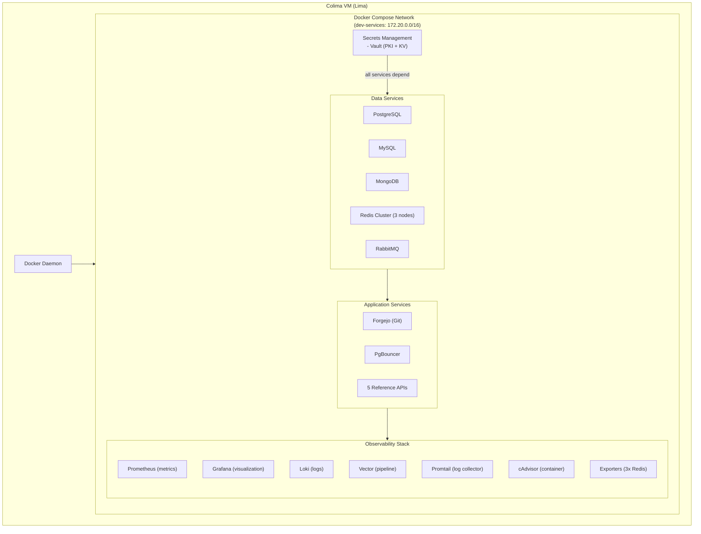
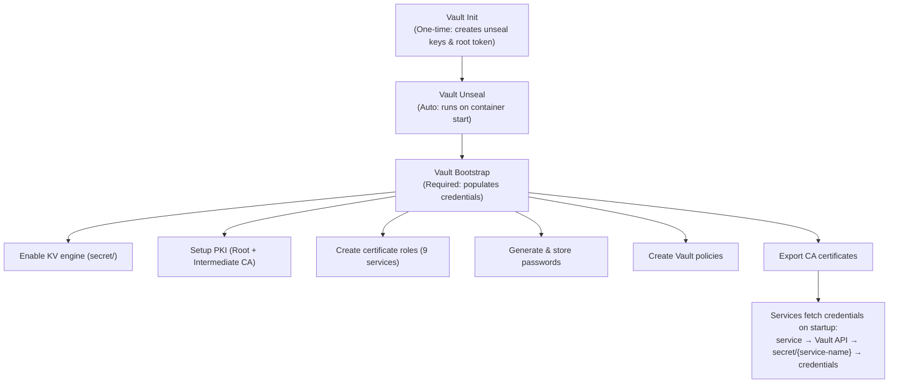
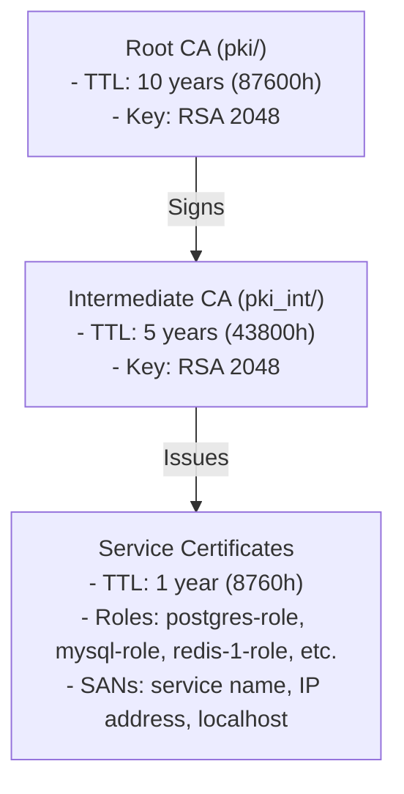
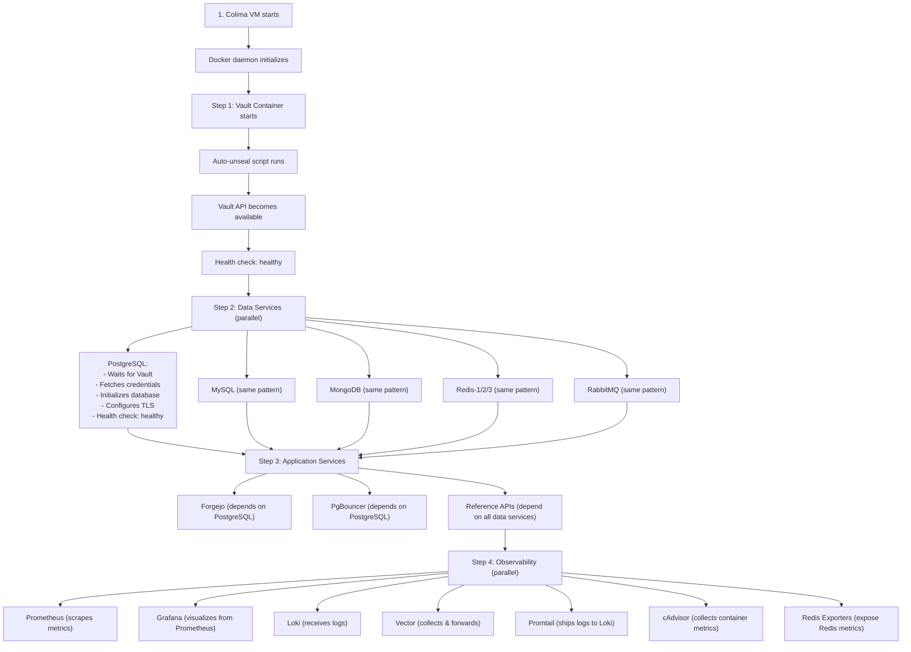
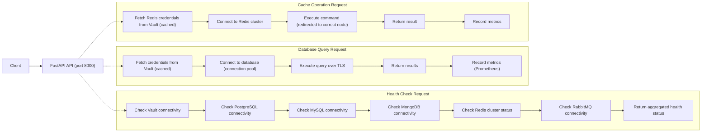
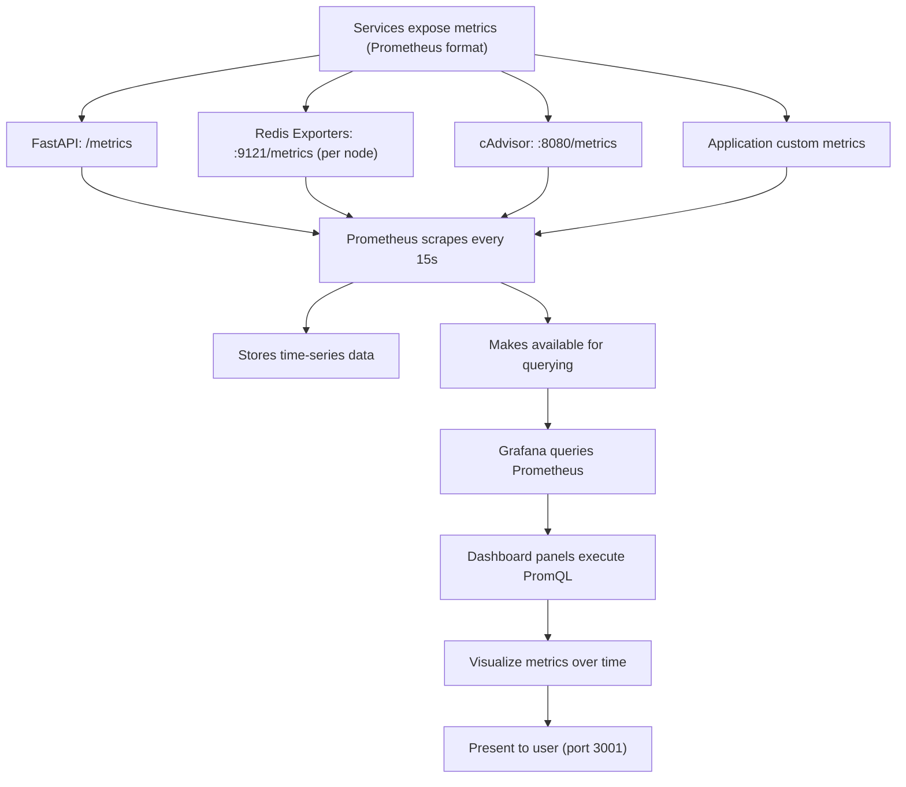
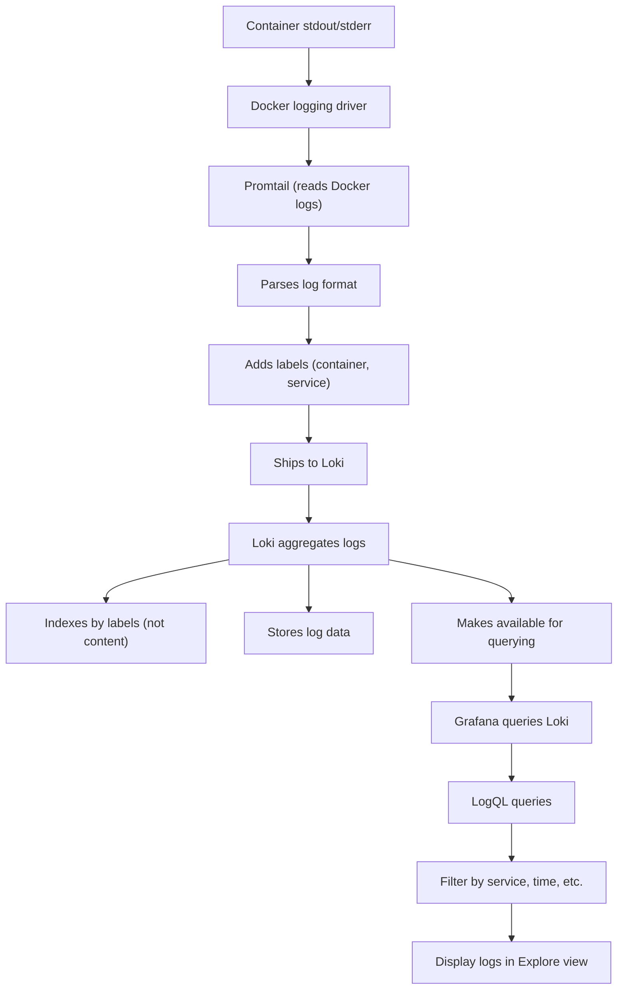
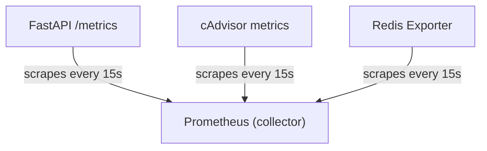
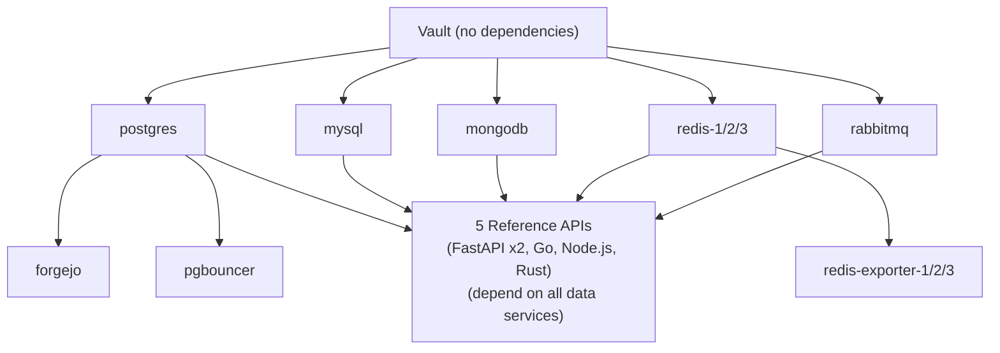

# Architecture Deep Dive

Complete architectural documentation for the DevStack Core infrastructure project.

---

## Table of Contents

1. [Overview](#overview)
2. [Architecture Philosophy](#architecture-philosophy)
3. [System Components](#system-components)
4. [Network Architecture](#network-architecture)
5. [Security Architecture](#security-architecture)
6. [Data Flow](#data-flow)
7. [Observability Architecture](#observability-architecture)
8. [Service Dependencies](#service-dependencies)
9. [Deployment Architecture](#deployment-architecture)
10. [Scaling Considerations](#scaling-considerations)

---

## Overview

DevStack Core is a **container-native, infrastructure-as-code** project providing a complete local development environment optimized for Apple Silicon Macs.

### Core Characteristics

- **Container Runtime:** Colima (Lima + containerd/Docker)
- **Orchestration:** Docker Compose
- **Service Count:** 28 containerized services
- **Network Model:** Bridge network with static IP assignments
- **Security Model:** Vault-managed credentials with optional TLS
- **Target Environment:** Local development (NOT production)

### Design Goals

1. **Completeness** - All services needed for modern development
2. **Security** - Vault-managed secrets, TLS support
3. **Observability** - Full metrics, logs, and visualization stack
4. **Educational** - Multiple reference implementations demonstrating patterns
5. **Reproducibility** - Infrastructure as code, Docker Compose

---

## Architecture Philosophy

### Infrastructure-First Approach

Services are defined declaratively in `docker-compose.yml` with:
- Explicit dependencies
- Health checks for all services
- Static IP assignments for predictability
- Volume persistence for stateful services
- Environment-based configuration

### Security by Design

- **No hardcoded credentials** - All passwords in Vault
- **TLS optional but supported** - PKI infrastructure via Vault
- **Secrets at runtime** - Services fetch credentials on startup
- **Network isolation** - Bridge network, no host mode
- **Secret scanning** - Pre-commit hooks and CI/CD

### Container-Native

- All services run in containers
- No host dependencies (except Colima/Docker)
- Portable across developers
- Easy to reset/rebuild

---

## System Components

### Component Hierarchy



### Service Catalog

| Service | Type | Port(s) | Purpose |
|---------|------|---------|---------|
| **vault** | Secrets | 8200 | Secrets management & PKI |
| **postgres** | Database | 5432 | PostgreSQL (Forgejo backend) |
| **pgbouncer** | Proxy | 6432 | PostgreSQL connection pooler |
| **mysql** | Database | 3306 | MySQL database |
| **mongodb** | Database | 27017 | MongoDB NoSQL |
| **redis-1/2/3** | Cache | 6379+ | Redis cluster (3 masters) |
| **rabbitmq** | Queue | 5672, 15672 | Message queue + mgmt UI |
| **forgejo** | Git | 3000, 2222 | Git server |
| **reference-api** | App | 8000, 8443 | FastAPI code-first |
| **api-first** | App | 8001, 8444 | FastAPI API-first |
| **golang-api** | App | 8002, 8445 | Go reference |
| **nodejs-api** | App | 8003, 8446 | Node.js/Express reference |
| **rust-api** | App | 8004, 8447 | Rust/Actix-web reference |
| **prometheus** | Metrics | 9090 | Metrics collection |
| **grafana** | Viz | 3001 | Dashboard & visualization |
| **loki** | Logs | 3100 | Log aggregation |
| **promtail** | Logs | - | Log shipping (internal) |
| **vector** | Pipeline | 8686 | Unified observability |
| **cadvisor** | Metrics | 8080 | Container metrics |
| **redis-exporter-1/2/3** | Metrics | 9121+ | Redis metrics (per node) |

### Reference API Implementations

This project includes **5 reference API implementations** demonstrating identical functionality across different technology stacks. Each implementation showcases best practices for integrating with the infrastructure services.

#### Purpose and Philosophy

**Why 5 Implementations?**
1. **Educational** - Demonstrate patterns across different languages and frameworks
2. **Comparison** - Enable performance and architecture comparisons
3. **Best Practices** - Show idiomatic approaches in each ecosystem
4. **Pattern Library** - Reference implementations for common integration patterns

**Shared Functionality:**
- HashiCorp Vault integration for secrets management
- PostgreSQL, MySQL, and MongoDB database connections
- Redis cluster integration with connection pooling
- RabbitMQ message queue integration
- Comprehensive health checks for all services
- Structured logging with security best practices
- Prometheus metrics exposition
- Optional TLS/SSL support
- RESTful API design

#### Implementation Details

##### 1. Python FastAPI (Code-First) - Port 8000/8443

**Location:** `reference-apps/fastapi/`

**Technology Stack:**
- **Framework:** FastAPI (async/await, Pydantic validation)
- **Language:** Python 3.11+
- **Approach:** Code-first (define routes in code, generate OpenAPI)
- **Key Libraries:** asyncpg, motor (MongoDB), redis-py, aio-pika

**Characteristics:**
- Fully asynchronous architecture
- Type hints and Pydantic models for validation
- Auto-generated OpenAPI/Swagger documentation
- Comprehensive endpoint coverage (all services)
- Production-ready logging and error handling

**Use Cases:**
- Rapid prototyping and development
- ML/AI integration scenarios
- Data-heavy applications
- Teams familiar with Python ecosystem

##### 2. Python FastAPI (API-First) - Port 8001/8444

**Location:** `reference-apps/fastapi-api-first/`

**Technology Stack:**
- **Framework:** FastAPI (async/await, Pydantic validation)
- **Language:** Python 3.11+
- **Approach:** API-first (OpenAPI spec → code generation)
- **Key Libraries:** asyncpg, motor, redis-py, aio-pika

**Characteristics:**
- OpenAPI specification drives implementation
- Contract-first design methodology
- Identical runtime behavior to code-first
- Demonstrates spec-driven development workflow
- Scaffolded structure for code generation

**Use Cases:**
- Contract-first API development
- Multi-team coordination (API contracts)
- Client SDK generation scenarios
- Governance and compliance requirements

##### 3. Go (Gin Framework) - Port 8002/8445

**Location:** `reference-apps/golang/`

**Technology Stack:**
- **Framework:** Gin (HTTP router and middleware)
- **Language:** Go 1.23+
- **Approach:** Code-first with strong typing
- **Key Libraries:** pgx (PostgreSQL), mongo-go-driver, go-redis, amqp091-go

**Characteristics:**
- Compiled binary for fast startup
- Strong static typing and compile-time checks
- Excellent concurrency with goroutines
- Low memory footprint
- Structured logging with logrus

**Use Cases:**
- High-performance requirements
- Microservices architectures
- Cloud-native deployments
- Systems programming background teams

##### 4. Node.js (Express) - Port 8003/8446

**Location:** `reference-apps/nodejs/`

**Technology Stack:**
- **Framework:** Express (minimalist web framework)
- **Language:** Node.js (JavaScript/TypeScript)
- **Approach:** Code-first with async/await
- **Key Libraries:** pg, mongodb, ioredis, amqplib

**Characteristics:**
- Event-driven, non-blocking I/O
- Large ecosystem (npm)
- Async/await for clean asynchronous code
- Full infrastructure integration
- JSON-native processing

**Use Cases:**
- JavaScript/TypeScript-centric teams
- Real-time applications (WebSockets)
- Rapid iteration and prototyping
- Microservices with npm ecosystem

##### 5. Rust (Actix-web) - Port 8004/8447

**Location:** `reference-apps/rust/`

**Technology Stack:**
- **Framework:** Actix-web (async actor framework)
- **Language:** Rust (memory-safe systems language)
- **Approach:** Minimal reference implementation
- **Key Libraries:** tokio-postgres, redis, deadpool

**Characteristics:**
- Zero-cost abstractions and memory safety
- Exceptional performance and low latency
- Compile-time guarantees (no runtime errors)
- Minimal implementation (core patterns only)
- High-performance async runtime (Tokio)

**Use Cases:**
- Ultra-high-performance requirements
- Safety-critical applications
- Resource-constrained environments
- Teams prioritizing performance and safety

#### API Parity and Testing

**Parity Tests:** `tests/api-parity-tests.sh`
- Validates identical behavior across implementations
- Tests all common endpoints
- Ensures consistent responses and error handling

**Performance Benchmarks:** `tests/performance-benchmark.sh`
- Compares throughput and latency
- Measures resource utilization
- Identifies performance characteristics per stack

#### Comparison Matrix

| Feature | FastAPI (Code) | FastAPI (API) | Go/Gin | Node.js | Rust |
|---------|----------------|---------------|--------|---------|------|
| **Startup Time** | Medium (~2s) | Medium (~2s) | Fast (<1s) | Fast (~1s) | Fast (<1s) |
| **Memory Footprint** | Medium (~80MB) | Medium (~80MB) | Low (~20MB) | Medium (~60MB) | Very Low (~10MB) |
| **Development Speed** | Fast | Medium | Medium | Fast | Slow |
| **Type Safety** | Runtime | Runtime | Compile-time | Runtime* | Compile-time |
| **Concurrency Model** | async/await | async/await | Goroutines | Event loop | async/await |
| **Ecosystem Size** | Large (PyPI) | Large (PyPI) | Medium | Very Large (npm) | Growing |
| **Learning Curve** | Low | Medium | Medium | Low | High |
| **Production Maturity** | High | High | Very High | Very High | High |

*Runtime with TypeScript, compile-time checks available

---

## Network Architecture

### Network Topology

**Bridge Network:** `dev-services`
- **Subnet:** 172.20.0.0/16
- **Gateway:** 172.20.0.1
- **DNS:** Docker embedded DNS

### Static IP Assignments

```
Core Infrastructure:
  172.20.0.5  - vault
  172.20.0.10 - postgres
  172.20.0.11 - pgbouncer
  172.20.0.12 - mysql
  172.20.0.13 - redis-1
  172.20.0.14 - rabbitmq
  172.20.0.15 - mongodb
  172.20.0.16 - redis-2
  172.20.0.17 - redis-3
  172.20.0.20 - forgejo

Application Services:
  172.20.0.100 - reference-api (FastAPI code-first)
  172.20.0.101 - api-first (FastAPI API-first)
  172.20.0.102 - golang-api (Go reference)
  172.20.0.103 - nodejs-api (Node.js/Express reference)
  172.20.0.104 - rust-api (Rust/Actix-web reference)

Observability:
  172.20.0.200 - prometheus
  172.20.0.201 - grafana
  172.20.0.202 - loki
  172.20.0.203 - promtail
  172.20.0.204 - vector
  172.20.0.205 - cadvisor
  172.20.0.206 - redis-exporter-1
  172.20.0.207 - redis-exporter-2
  172.20.0.208 - redis-exporter-3
```

### Port Exposure Strategy

**Exposed to Host:**
- Web UIs: Grafana (3001), RabbitMQ (15672), Prometheus (9090), Loki (3100)
- Databases: PostgreSQL (5432), MySQL (3306), MongoDB (27017), Redis (6379+)
- Applications: APIs on 8000-8004 (HTTP) and 8443-8447 (HTTPS)
- Git: Forgejo HTTP (3000), SSH (2222)
- Vault: 8200

**Internal Only:**
- Container metrics (cAdvisor)
- Log shipping (Promtail)
- Exporters (internal scraping)

### DNS Resolution

Services resolve each other by service name:
- `postgres` resolves to 172.20.0.10
- `vault` resolves to 172.20.0.5
- Etc.

Docker's embedded DNS handles resolution within the `dev-services` network.

---

## Security Architecture

### Secrets Management Flow



### PKI Architecture

**Two-Tier Certificate Authority:**



**Certificate Issuance Flow:**
1. Service requests cert from Vault PKI
2. Vault validates request against role
3. Intermediate CA signs certificate
4. Service receives cert + private key
5. Service configures TLS with cert

### TLS Configuration

**Optional TLS (Development Mode):**
- Controlled by `tls_enabled` flag in Vault
- Default: `true` for all services
- Services check flag on startup
- If enabled: configure TLS
- If disabled: plain connections

**TLS Endpoints:**
- PostgreSQL: Port 5432 (TLS)
- MySQL: Port 3306 (TLS)
- MongoDB: Port 27017 (preferTLS)
- Redis: Ports 6390-6392 (TLS on separate ports)
- RabbitMQ: Port 5671 (TLS)
- APIs: Ports 8443-8447 (HTTPS)

### Credential Storage

**In Vault (secret/ KV engine):**
```
secret/postgresql
  ├─ username: dev_admin
  ├─ password: <25-char random>
  ├─ database: dev_database
  └─ tls_enabled: true

secret/mysql
  ├─ root_password: <25-char random>
  ├─ username: dev_user
  ├─ password: <25-char random>
  ├─ database: dev_database
  └─ tls_enabled: true

secret/redis-1, redis-2, redis-3
  ├─ password: <shared 25-char random>
  └─ tls_enabled: true

secret/rabbitmq
  ├─ username: dev_user
  ├─ password: <25-char random>
  ├─ vhost: dev_vhost
  └─ tls_enabled: true

secret/mongodb
  ├─ username: dev_user
  ├─ password: <25-char random>
  ├─ database: dev_database
  └─ tls_enabled: true
```

### Network Security

- **No host network mode** - All services use bridge
- **Static IPs** - Predictable, no dynamic assignment
- **Internal-only services** - Many services not exposed to host
- **Firewall-ready** - Port exposure controlled via Docker

---

## Data Flow

### Service Startup Flow



### Request Flow (FastAPI Example)



### Metrics Collection Flow



### Log Collection Flow



---

## Observability Architecture

### Three Pillars

1. **Metrics** (Prometheus + Grafana)
2. **Logs** (Loki + Promtail + Grafana)
3. **Traces** (Future: OpenTelemetry)

### Metrics Pipeline



**Metric Types:**
- **Counters:** Request counts, error counts
- **Gauges:** Active connections, memory usage
- **Histograms:** Request durations, response sizes
- **Summaries:** Percentiles (p50, p95, p99)

### Grafana Dashboards

Pre-configured dashboards in `configs/grafana/dashboards/`:
1. **redis-cluster-dashboard.json** - Redis cluster health
2. **postgres-dashboard.json** - PostgreSQL metrics
3. **mysql-dashboard.json** - MySQL metrics
4. **mongodb-dashboard.json** - MongoDB metrics
5. **application-metrics.json** - API metrics
6. **infrastructure-overview.json** - Overall health

### Log Aggregation Strategy

**Structured Logging:**
- JSON format for all application logs
- Consistent fields: timestamp, level, message, service, request_id
- Easy to parse and query

**Label Strategy:**
```
{service="fastapi", container="dev-reference-api", level="error"}
{service="postgres", container="dev-postgres"}
{service="redis-1", container="dev-redis-1"}
```

**Retention:**
- Development: 7 days (configurable)
- Logs stored in Docker volumes

---

## Service Dependencies

### Dependency Graph



### Health Check Cascade

Each service has a health check that validates:
1. Process is running
2. Port is listening
3. Service-specific checks (e.g., DB can execute queries)

Docker Compose won't start dependent services until dependencies are healthy.

### Startup Order

```
1. Vault (5-10s to unseal)
2. Data Services (30-60s for initialization)
   - PostgreSQL, MySQL, MongoDB
   - Redis cluster (needs all 3 nodes)
   - RabbitMQ
3. Application Services (10-20s)
   - Forgejo (waits for PostgreSQL)
   - PgBouncer (waits for PostgreSQL)
   - 5 Reference APIs (wait for all data services)
     * FastAPI code-first (port 8000)
     * FastAPI API-first (port 8001)
     * Go/Gin (port 8002)
     * Node.js/Express (port 8003)
     * Rust/Actix-web (port 8004)
4. Observability (starts immediately, waits for targets)
   - Prometheus, Grafana, Loki start fast
   - Begin scraping/collecting once targets available
```

**Total Startup Time:** ~90-120 seconds from cold start

---

## Deployment Architecture

### Colima VM Specifications

**Default Configuration:**
- **CPU:** 4 cores
- **Memory:** 8 GB
- **Disk:** 60 GB
- **Architecture:** ARM64 (Apple Silicon)
- **Runtime:** Docker
- **Networking:** Bridged (VZ framework)

**Customizable via manage-devstack.sh:**
```bash
COLIMA_CPU=8 COLIMA_MEMORY=16 COLIMA_DISK=100 ./manage-devstack.sh start
```

### Volume Strategy

**Named Volumes (Persistent):**
- `postgres_data` - PostgreSQL database files
- `mysql_data` - MySQL database files
- `mongodb_data` - MongoDB database files
- `redis_data_1/2/3` - Redis persistence (3 volumes)
- `rabbitmq_data` - RabbitMQ message store
- `vault_data` - Vault storage backend
- `forgejo_data` - Git repositories
- `prometheus_data` - Time-series metrics
- `grafana_data` - Dashboard configs
- `loki_data` - Log storage

**Bind Mounts (Configuration):**
- `./configs/{service}/` → Container config directories
- Configuration files are version-controlled

**Benefits:**
- Data persists across container restarts
- Can backup volumes independently
- Easy to reset individual services

### Resource Allocation

**Per-Service Limits (if configured):**
- Not set by default (development mode)
- Can add via deploy.resources in docker-compose.yml
- Recommended for resource-constrained environments

**Observed Resource Usage (28 services):**
- **Total Memory:** ~4-6 GB
- **Total CPU:** ~1-2 cores average
- **Disk:** ~10-15 GB (with data)

---

## Scaling Considerations

### Current Limitations (Development Mode)

1. **Single-Node Redis Cluster**
   - 3 masters, no replicas
   - No high availability
   - Suitable for development only

2. **Single Instance Per Service**
   - No load balancing
   - No redundancy
   - Fast restarts instead

3. **File-Based Vault Storage**
   - Not HA-capable
   - Single point of failure
   - Fine for development

### Production Adaptation Strategies

**If adapting for production:**

1. **Redis Cluster**
   - Add replicas: 3 masters + 3 replicas minimum
   - Enable cluster failover
   - Use Redis Sentinel or Redis Cluster mode

2. **Database Replication**
   - PostgreSQL: Streaming replication (primary + standby)
   - MySQL: Master-slave or Galera cluster
   - MongoDB: Replica sets (3+ nodes)

3. **Vault**
   - Consul or etcd storage backend
   - 3+ Vault nodes for HA
   - Auto-unsealing via cloud KMS

4. **Load Balancing**
   - Add nginx/traefik for API load balancing
   - Multiple API instances
   - Session affinity if needed

5. **Observability**
   - Prometheus federation for multiple clusters
   - Remote write to long-term storage (Thanos, Cortex)
   - Centralized Loki for multi-cluster logs

### Horizontal Scaling

**Services that can scale horizontally:**
- ✅ Reference APIs (stateless)
- ✅ PgBouncer (connection pooler)
- ⚠️ Forgejo (needs shared storage)

**Services that require special handling:**
- ❌ Databases (need replication setup)
- ❌ Redis (needs cluster reconfiguration)
- ❌ RabbitMQ (needs cluster mode)
- ❌ Vault (needs HA storage backend)

---

## Architectural Patterns

### Initialization Pattern

All stateful services follow this pattern:
```bash
#!/bin/bash
# init.sh

1. Wait for Vault to be ready (health check loop)
2. Fetch credentials from Vault (secret/{service})
3. Parse credentials (jq)
4. Configure service with credentials
5. Start service process
6. Health check validates service is ready
```

### Configuration Pattern

```
Environment Variables (from docker-compose.yml)
  │
  ▼
Service init script (./init.sh)
  │
  ├─► Fetch secrets from Vault
  ├─► Generate config files
  └─► Export environment

Service starts with configuration
```

### Health Check Pattern

```yaml
healthcheck:
  test: ["CMD", "command", "to", "test", "health"]
  interval: 10s
  timeout: 5s
  retries: 5
  start_period: 30s
```

**Progressive Health Checks:**
1. Start period: Service initialization time
2. Interval: How often to check
3. Retries: How many failures before unhealthy
4. Timeout: Max time for check command

---

## Future Architecture Considerations

### Potential Enhancements

1. **Service Mesh (Istio/Linkerd)**
   - mTLS between services
   - Advanced traffic management
   - Observability built-in

2. **Kubernetes Migration**
   - Convert docker-compose to K8s manifests
   - Use Helm charts
   - Enable true cloud-native operations

3. **GitOps Integration**
   - ArgoCD or Flux
   - Declarative configuration management
   - Automated drift detection

4. **Multi-Environment Support**
   - Dev, staging, production configs
   - Environment-specific overrides
   - Promotion workflows

---

## Reference Documentation

- [Docker Compose Networking](https://docs.docker.com/compose/networking/)
- [HashiCorp Vault Architecture](https://www.vaultproject.io/docs/internals/architecture)
- [Prometheus Architecture](https://prometheus.io/docs/introduction/overview/)
- [Redis Cluster Specification](https://redis.io/docs/latest/operate/oss_and_stack/management/scaling/)
- [Colima Documentation](https://github.com/abiosoft/colima)

---

*For operational procedures, see [TROUBLESHOOTING.md](./TROUBLESHOOTING.md). For performance optimization, see [PERFORMANCE_TUNING.md](./PERFORMANCE_TUNING.md).*
