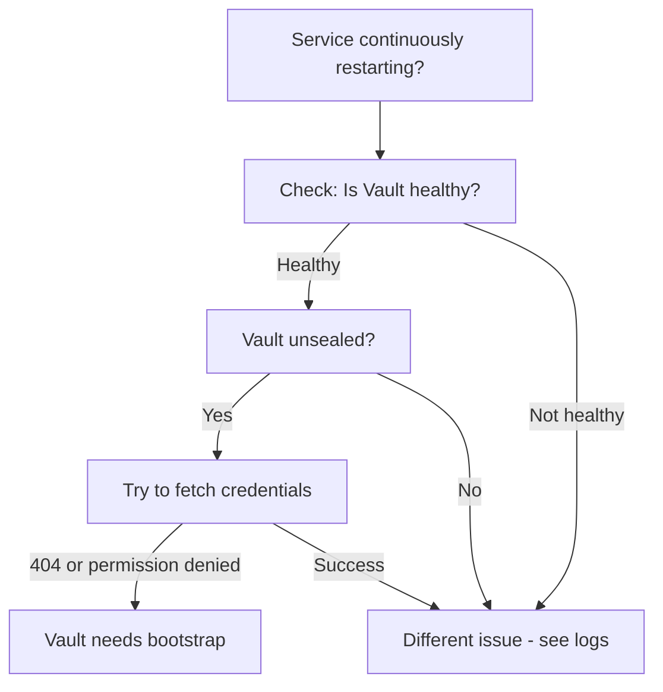
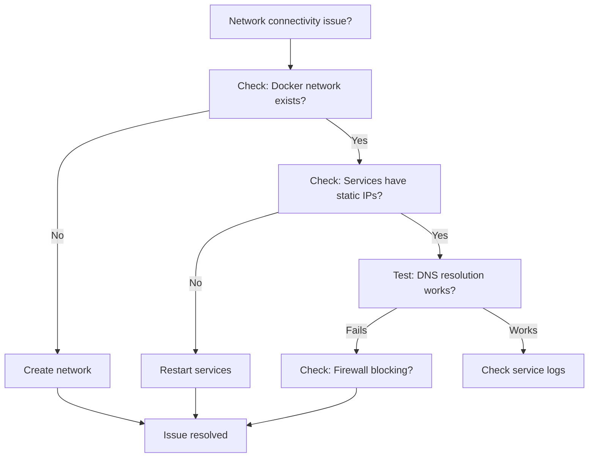

# Troubleshooting Guide

Comprehensive troubleshooting guide for common issues in the Colima Services infrastructure.

---

## Table of Contents

1. [Startup Issues](#startup-issues)
2. [Service Health Check Failures](#service-health-check-failures)
3. [Network Connectivity Problems](#network-connectivity-problems)
4. [Database Issues](#database-issues)
5. [Redis Cluster Issues](#redis-cluster-issues)
6. [Vault Issues](#vault-issues)
7. [Docker/Colima Issues](#dockercolima-issues)
8. [Testing Failures](#testing-failures)
9. [Performance Issues](#performance-issues)
10. [TLS/Certificate Issues](#tlscertificate-issues)
11. [Diagnostic Commands](#diagnostic-commands)

---

## Startup Issues

### Issue: Services Continuously Restarting After Fresh Start

**Symptoms:**
```bash
$ docker ps
CONTAINER ID   NAME              STATUS
abc123         dev-postgres-1    Restarting (1) 30 seconds ago
def456         dev-redis-1       Restarting (1) 25 seconds ago
```

**Logs show:**
```
Installing jq...
Installing jq...
Installing jq...
(repeating in a loop)
```

**Root Cause:** Vault is unsealed but **NOT bootstrapped** with service credentials.

**Diagnostic Flow:**



**Solution:**

1. **Verify Vault is unsealed:**
```bash
docker exec dev-vault-1 vault status
```

Expected output:
```
Sealed          false
```

2. **Check if credentials exist:**
```bash
VAULT_ADDR=http://localhost:8200 \
VAULT_TOKEN=$(cat ~/.config/vault/root-token) \
vault kv get secret/postgresql
```

If you get `404` or `permission denied`, Vault needs bootstrap.

3. **Run Vault bootstrap:**
```bash
VAULT_ADDR=http://localhost:8200 \
VAULT_TOKEN=$(cat ~/.config/vault/root-token) \
bash configs/vault/scripts/vault-bootstrap.sh
```

Expected output:
```
✓ KV secrets engine enabled
✓ Root CA created
✓ Intermediate CA created
✓ Certificate roles created (9 services)
✓ Credentials generated and stored
✓ Policies created
✓ CA certificates exported
```

4. **Restart failing services:**
```bash
docker compose restart postgres redis-1 redis-2 redis-3 mysql mongodb rabbitmq
```

5. **Verify all services are healthy:**
```bash
docker ps --format "table {{.Names}}\t{{.Status}}"
```

All services should show `Up` and `healthy` within 60 seconds.

**Prevention:**
Add automatic bootstrap check to `manage-colima.sh start` (see [Future Enhancements](#future-enhancements)).

---

### Issue: Colima VM Won't Start

**Symptoms:**
```bash
$ ./manage-colima.sh start
ERRO[0000] error starting vm: error creating instance
```

**Common Causes:**

1. **Insufficient disk space**
```bash
# Check available space
df -h ~

# Solution: Free up disk space or adjust COLIMA_DISK
COLIMA_DISK=100 ./manage-colima.sh start
```

2. **VZ framework issue (macOS Ventura+)**
```bash
# Check Colima version
colima version

# Update Colima if outdated
brew upgrade colima

# Restart with fresh config
colima delete
./manage-colima.sh start
```

3. **Port conflicts**
```bash
# Check if ports are already in use
lsof -i :8200  # Vault
lsof -i :5432  # PostgreSQL
lsof -i :3001  # Grafana

# Stop conflicting services or change ports in docker-compose.yml
```

---

### Issue: Docker Compose Services Won't Start

**Symptoms:**
```bash
$ docker compose up -d
ERROR: yaml.parser.ParserError
```

**Solutions:**

1. **YAML syntax error:**
```bash
# Validate docker-compose.yml
docker compose config

# Look for the error line and fix indentation/syntax
```

2. **Invalid environment variables:**
```bash
# Check .env file exists and has correct format
cat .env

# No spaces around = signs
# Correct:   VAR=value
# Incorrect: VAR = value
```

3. **Missing Docker network:**
```bash
# Create network manually if needed
docker network create dev-services --subnet 172.20.0.0/16
```

---

## Service Health Check Failures

### General Health Check Debugging

**Check health status:**
```bash
docker ps --format "table {{.Names}}\t{{.Status}}\t{{.Ports}}"
```

**Inspect specific service health:**
```bash
docker inspect dev-postgres-1 --format='{{json .State.Health}}' | jq
```

**View health check logs:**
```bash
docker logs dev-postgres-1 --tail 50
```

### Service-Specific Health Check Issues

#### PostgreSQL Health Check Failing

**Diagnostic:**
```bash
# Check if PostgreSQL is running
docker exec dev-postgres-1 pg_isready -U postgres

# Check if credentials were fetched
docker logs dev-postgres-1 | grep "Fetched credentials"

# Try connecting manually
docker exec -it dev-postgres-1 psql -U dev_admin -d dev_database
```

**Common fixes:**
- Vault not bootstrapped (see [Vault Bootstrap](#issue-services-continuously-restarting-after-fresh-start))
- Incorrect credentials in Vault
- Database initialization failed (check logs)

#### Redis Cluster Health Check Failing

**Diagnostic:**
```bash
# Check cluster status
docker exec dev-redis-1 redis-cli -a $(VAULT_ADDR=http://localhost:8200 VAULT_TOKEN=$(cat ~/.config/vault/root-token) vault kv get -field=password secret/redis-1) cluster info

# Check cluster nodes
docker exec dev-redis-1 redis-cli -a <password> cluster nodes
```

**Common issues:**
- Not all 3 nodes started yet (wait 30s)
- Cluster not formed (check `configs/redis/scripts/init.sh`)
- Network issue between nodes (check `docker network inspect dev-services`)

#### MySQL Health Check Failing

**Diagnostic:**
```bash
# Check if MySQL is ready
docker exec dev-mysql-1 mysqladmin ping

# Check logs
docker logs dev-mysql-1 | grep -i error

# Try connecting
docker exec -it dev-mysql-1 mysql -u dev_user -p dev_database
```

---

## Network Connectivity Problems

### Issue: Services Can't Reach Each Other

**Symptoms:**
- APIs can't connect to databases
- "Connection refused" or "Host not found" errors

**Diagnostic:**



**Solutions:**

1. **Verify Docker network:**
```bash
docker network ls | grep dev-services
docker network inspect dev-services
```

Expected: 172.20.0.0/16 subnet with all services listed.

2. **Check service IP assignments:**
```bash
docker inspect dev-vault-1 --format='{{range .NetworkSettings.Networks}}{{.IPAddress}}{{end}}'
# Should be: 172.20.0.5

docker inspect dev-postgres-1 --format='{{range .NetworkSettings.Networks}}{{.IPAddress}}{{end}}'
# Should be: 172.20.0.10
```

3. **Test DNS resolution:**
```bash
# From one container to another
docker exec dev-reference-api-1 ping -c 2 postgres
docker exec dev-reference-api-1 ping -c 2 vault
```

4. **Test connectivity:**
```bash
# Test database connectivity from API container
docker exec dev-reference-api-1 nc -zv postgres 5432
docker exec dev-reference-api-1 nc -zv redis-1 6379
```

5. **Restart network if needed:**
```bash
docker compose down
docker network rm dev-services
docker network create dev-services --subnet 172.20.0.0/16
docker compose up -d
```

---

### Issue: Can't Access Services from Host

**Symptoms:**
- `curl http://localhost:8000` fails
- `psql -h localhost -p 5432` times out

**Solutions:**

1. **Check port bindings:**
```bash
docker ps --format "table {{.Names}}\t{{.Ports}}"
```

Expected: `0.0.0.0:8000->8000/tcp` for exposed services.

2. **Verify Colima VM networking:**
```bash
colima status

# Check VZ networking is enabled
colima list
```

3. **Test with explicit IP:**
```bash
# Get Colima VM IP
colima list -j | jq -r '.[0].address'

# Try connecting to service via VM IP
curl http://<vm-ip>:8000/health
```

---

## Database Issues

### PostgreSQL Connection Errors

**Error:** `FATAL: password authentication failed`

**Solutions:**

1. **Verify credentials in Vault:**
```bash
VAULT_ADDR=http://localhost:8200 \
VAULT_TOKEN=$(cat ~/.config/vault/root-token) \
vault kv get secret/postgresql
```

2. **Check pg_hba.conf:**
```bash
docker exec dev-postgres-1 cat /var/lib/postgresql/data/pg_hba.conf
```

Should include:
```
host    all             all             172.20.0.0/16           md5
```

3. **Reset PostgreSQL:**
```bash
docker compose stop postgres
docker volume rm colima-services_postgres_data
docker compose up -d postgres
```

---

### MySQL Connection Errors

**Error:** `Access denied for user 'dev_user'@'172.20.0.100'`

**Solutions:**

1. **Check user grants:**
```bash
docker exec dev-mysql-1 mysql -u root -p$(VAULT_ADDR=http://localhost:8200 VAULT_TOKEN=$(cat ~/.config/vault/root-token) vault kv get -field=root_password secret/mysql) -e "SELECT user,host FROM mysql.user;"
```

2. **Recreate user:**
```bash
docker exec -it dev-mysql-1 mysql -u root -p

mysql> DROP USER IF EXISTS 'dev_user'@'%';
mysql> CREATE USER 'dev_user'@'%' IDENTIFIED BY '<password_from_vault>';
mysql> GRANT ALL PRIVILEGES ON dev_database.* TO 'dev_user'@'%';
mysql> FLUSH PRIVILEGES;
```

---

### MongoDB Authentication Failed

**Error:** `Authentication failed`

**Solutions:**

1. **Verify MongoDB credentials:**
```bash
VAULT_ADDR=http://localhost:8200 \
VAULT_TOKEN=$(cat ~/.config/vault/root-token) \
vault kv get secret/mongodb
```

2. **Test connection:**
```bash
docker exec -it dev-mongodb-1 mongosh -u dev_user -p <password> --authenticationDatabase admin dev_database
```

3. **Reset MongoDB:**
```bash
docker compose stop mongodb
docker volume rm colima-services_mongodb_data
docker compose up -d mongodb
```

---

## Redis Cluster Issues

### Issue: Redis Cluster Not Forming

**Symptoms:**
```bash
$ docker logs dev-redis-1 | grep cluster
[ERR] Node is not in cluster mode
```

**Solutions:**

1. **Check all 3 nodes are running:**
```bash
docker ps | grep redis
```

All three (redis-1, redis-2, redis-3) must be healthy.

2. **Check cluster configuration:**
```bash
docker exec dev-redis-1 redis-cli -a <password> cluster info
```

Expected:
```
cluster_state:ok
cluster_slots_assigned:16384
cluster_known_nodes:3
```

3. **Manually create cluster:**
```bash
docker exec dev-redis-1 redis-cli -a <password> --cluster create \
  172.20.0.13:6379 \
  172.20.0.16:6379 \
  172.20.0.17:6379 \
  --cluster-replicas 0
```

4. **Reset cluster:**
```bash
docker compose stop redis-1 redis-2 redis-3
docker volume rm colima-services_redis_data_1 colima-services_redis_data_2 colima-services_redis_data_3
docker compose up -d redis-1 redis-2 redis-3
```

---

### Issue: Redis MOVED Errors

**Error:** `MOVED 12345 172.20.0.16:6379`

**Explanation:** This is **normal behavior** for Redis Cluster. Clients must follow redirects.

**Solutions:**

1. **Use cluster-aware client:**
```python
# Python example
from redis.cluster import RedisCluster

rc = RedisCluster(host='172.20.0.13', port=6379, password='...')
```

2. **Test cluster operations:**
```bash
docker exec dev-redis-1 redis-cli -a <password> -c
127.0.0.1:6379> SET mykey myvalue
-> Redirected to slot [14687] located at 172.20.0.16:6379
OK
```

Note the `-c` flag enables cluster mode (follows redirects).

---

## Vault Issues

### Issue: Vault is Sealed

**Symptoms:**
```bash
$ curl http://localhost:8200/v1/sys/health
{"sealed":true}
```

**Solutions:**

1. **Check Vault status:**
```bash
docker exec dev-vault-1 vault status
```

2. **Unseal Vault manually:**
```bash
docker exec dev-vault-1 vault operator unseal $(cat ~/.config/vault/unseal-key-1)
docker exec dev-vault-1 vault operator unseal $(cat ~/.config/vault/unseal-key-2)
docker exec dev-vault-1 vault operator unseal $(cat ~/.config/vault/unseal-key-3)
```

3. **Or use auto-unseal script:**
```bash
docker exec dev-vault-1 /vault/scripts/vault-auto-unseal.sh
```

4. **Restart Vault (auto-unseals on startup):**
```bash
docker compose restart vault
```

---

### Issue: Vault Token Expired

**Error:** `permission denied`

**Solutions:**

1. **Check token TTL:**
```bash
VAULT_ADDR=http://localhost:8200 \
VAULT_TOKEN=$(cat ~/.config/vault/root-token) \
vault token lookup
```

2. **Use root token:**
```bash
# Root token never expires
export VAULT_TOKEN=$(cat ~/.config/vault/root-token)
```

3. **Create new token:**
```bash
VAULT_ADDR=http://localhost:8200 \
VAULT_TOKEN=$(cat ~/.config/vault/root-token) \
vault token create -policy=admin
```

---

### Issue: Can't Read Secrets from Vault

**Error:** `* permission denied`

**Diagnostic:**
```bash
# Check if secret exists
VAULT_ADDR=http://localhost:8200 \
VAULT_TOKEN=$(cat ~/.config/vault/root-token) \
vault kv list secret/

# Try reading specific secret
vault kv get secret/postgresql
```

**Solutions:**

1. **If secret doesn't exist - run bootstrap:**
```bash
VAULT_ADDR=http://localhost:8200 \
VAULT_TOKEN=$(cat ~/.config/vault/root-token) \
bash configs/vault/scripts/vault-bootstrap.sh
```

2. **If permission denied - check policy:**
```bash
vault token lookup
# Check "policies" field includes necessary policies
```

---

## Docker/Colima Issues

### Issue: Docker Daemon Not Running

**Symptoms:**
```bash
$ docker ps
Cannot connect to the Docker daemon
```

**Solutions:**

1. **Check Colima status:**
```bash
colima status
```

2. **Start Colima:**
```bash
colima start
```

Or use manage script:
```bash
./manage-colima.sh start
```

3. **If stuck, force restart:**
```bash
colima stop -f
colima start
```

---

### Issue: Out of Disk Space

**Symptoms:**
```bash
$ docker system df
Images          50GB
Containers      10GB
Volumes         20GB
```

**Solutions:**

1. **Clean up unused resources:**
```bash
# Remove unused containers, networks, images
docker system prune -a

# Remove unused volumes (WARNING: deletes data!)
docker volume prune
```

2. **Remove specific volumes:**
```bash
# List volumes
docker volume ls

# Remove specific volume
docker volume rm colima-services_prometheus_data
```

3. **Increase Colima disk:**
```bash
colima stop
# Edit ~/.colima/default/colima.yaml
# Change disk: 100G

colima start
```

---

### Issue: Slow Container Performance

**Symptoms:**
- Containers are slow
- High CPU usage

**Solutions:**

1. **Increase Colima resources:**
```bash
# Stop Colima
colima stop

# Start with more resources
COLIMA_CPU=8 COLIMA_MEMORY=16 ./manage-colima.sh start
```

2. **Check resource usage:**
```bash
docker stats
```

3. **Limit individual containers:**
```yaml
# In docker-compose.yml
services:
  postgres:
    deploy:
      resources:
        limits:
          cpus: '2'
          memory: 2G
```

---

## Testing Failures

### Issue: Infrastructure Tests Failing

**Common test failures and solutions:**

1. **Test: Vault health check**
```bash
# Manual test
curl -s http://localhost:8200/v1/sys/health | jq

# Should return: "sealed": false
```

**Fix:** Unseal Vault (see [Vault is Sealed](#issue-vault-is-sealed))

2. **Test: Service connectivity**
```bash
# Manual test
docker exec dev-reference-api-1 curl -s http://postgres:5432
```

**Fix:** Check network connectivity (see [Network Issues](#network-connectivity-problems))

3. **Test: Redis cluster**
```bash
# Run specific test
bash tests/infrastructure/test_redis_cluster.sh
```

**Fix:** See [Redis Cluster Issues](#redis-cluster-issues)

---

### Issue: Python Tests Failing

**Running specific test suites:**

1. **FastAPI unit tests:**
```bash
cd reference-apps/fastapi
pytest tests/ -v
```

2. **With coverage:**
```bash
pytest tests/ --cov=app --cov-report=term-missing
```

3. **Specific test file:**
```bash
pytest tests/test_api.py::test_health_check -v
```

**Common issues:**

- **Import errors:** Check virtual environment is activated
- **Connection errors:** Ensure services are healthy
- **Credential errors:** Run Vault bootstrap

---

### Issue: Go Tests Failing

**Running Go tests:**

```bash
cd reference-apps/golang
go test ./... -v
```

**Common issues:**

1. **Build errors:**
```bash
go mod tidy
go mod download
```

2. **Test timeout:**
```bash
go test ./... -v -timeout 5m
```

---

## Performance Issues

### Issue: Slow API Response Times

**Diagnostic:**

1. **Check API metrics:**
```bash
curl http://localhost:8000/metrics | grep http_request_duration
```

2. **Check database connection pooling:**
```bash
docker logs dev-reference-api-1 | grep "pool"
```

3. **Monitor with Grafana:**
- Open http://localhost:3001
- Check "Application Metrics" dashboard
- Look for slow queries or high latency

**Solutions:**

1. **Increase connection pool size:**
```python
# In reference-apps/fastapi/app/database.py
POOL_SIZE = 20  # Increase from default 10
```

2. **Add caching:**
```python
# Use Redis for caching
from redis import Redis
cache = Redis(host='redis-1', port=6379)
```

3. **Optimize database queries:**
```bash
# Check slow queries in PostgreSQL
docker exec dev-postgres-1 psql -U dev_admin -d dev_database -c \
  "SELECT query, calls, total_time FROM pg_stat_statements ORDER BY total_time DESC LIMIT 10;"
```

---

### Issue: High Memory Usage

**Diagnostic:**
```bash
docker stats --no-stream
```

**Solutions:**

1. **Restart high-memory services:**
```bash
docker compose restart <service>
```

2. **Add memory limits:**
```yaml
# docker-compose.yml
services:
  mongodb:
    deploy:
      resources:
        limits:
          memory: 2G
```

3. **Increase Colima memory:**
```bash
COLIMA_MEMORY=16 ./manage-colima.sh start
```

---

## TLS/Certificate Issues

### Issue: Certificate Verification Failed

**Error:** `SSL certificate problem: unable to get local issuer certificate`

**Solutions:**

1. **Check CA certificate exists:**
```bash
ls -la ~/.config/vault/ca/
# Should have: ca-chain.pem, root-ca.pem, intermediate-ca.pem
```

2. **Re-export CA certificates:**
```bash
VAULT_ADDR=http://localhost:8200 \
VAULT_TOKEN=$(cat ~/.config/vault/root-token) \
bash configs/vault/scripts/vault-bootstrap.sh
```

3. **Trust CA certificate (macOS):**
```bash
sudo security add-trusted-cert -d -r trustRoot -k /Library/Keychains/System.keychain ~/.config/vault/ca/root-ca.pem
```

4. **Use CA in API calls:**
```bash
curl --cacert ~/.config/vault/ca/ca-chain.pem https://localhost:8443/health
```

---

### Issue: TLS Handshake Timeout

**Diagnostic:**
```bash
openssl s_client -connect localhost:8443 -CAfile ~/.config/vault/ca/ca-chain.pem
```

**Solutions:**

1. **Check TLS is enabled in Vault:**
```bash
VAULT_ADDR=http://localhost:8200 \
VAULT_TOKEN=$(cat ~/.config/vault/root-token) \
vault kv get -field=tls_enabled secret/postgresql
```

2. **Verify certificate validity:**
```bash
docker exec dev-postgres-1 openssl x509 -in /etc/ssl/certs/postgres.crt -text -noout
```

3. **Regenerate certificates:**
```bash
# Re-run bootstrap
VAULT_ADDR=http://localhost:8200 \
VAULT_TOKEN=$(cat ~/.config/vault/root-token) \
bash configs/vault/scripts/vault-bootstrap.sh

# Restart service
docker compose restart postgres
```

---

## Diagnostic Commands

### Complete Health Check

Run all health checks:
```bash
bash tests/infrastructure/run_all_tests.sh
```

### Service-Specific Diagnostics

**Vault:**
```bash
docker exec dev-vault-1 vault status
docker logs dev-vault-1 --tail 50
curl http://localhost:8200/v1/sys/health | jq
```

**PostgreSQL:**
```bash
docker exec dev-postgres-1 pg_isready
docker logs dev-postgres-1 --tail 50
docker exec dev-postgres-1 psql -U dev_admin -d dev_database -c "SELECT version();"
```

**Redis Cluster:**
```bash
docker exec dev-redis-1 redis-cli -a <password> cluster info
docker exec dev-redis-1 redis-cli -a <password> cluster nodes
docker logs dev-redis-1 --tail 50
```

**MySQL:**
```bash
docker exec dev-mysql-1 mysqladmin ping
docker logs dev-mysql-1 --tail 50
docker exec dev-mysql-1 mysql -u dev_user -p<password> -e "SHOW DATABASES;"
```

**MongoDB:**
```bash
docker exec dev-mongodb-1 mongosh --eval "db.adminCommand('ping')"
docker logs dev-mongodb-1 --tail 50
```

**RabbitMQ:**
```bash
docker exec dev-rabbitmq-1 rabbitmqctl status
docker logs dev-rabbitmq-1 --tail 50
curl -u dev_user:<password> http://localhost:15672/api/overview | jq
```

### Network Diagnostics

**Check all IPs:**
```bash
docker network inspect dev-services --format='{{range .Containers}}{{.Name}}: {{.IPv4Address}}{{"\n"}}{{end}}'
```

**Test DNS resolution:**
```bash
docker exec dev-reference-api-1 nslookup vault
docker exec dev-reference-api-1 nslookup postgres
```

**Test connectivity matrix:**
```bash
for service in vault postgres mysql mongodb redis-1 rabbitmq; do
  echo "Testing $service..."
  docker exec dev-reference-api-1 nc -zv $service $(docker port dev-$service-1 | head -1 | cut -d: -f2) 2>&1 | grep -q "succeeded" && echo "✓ $service" || echo "✗ $service"
done
```

### Performance Diagnostics

**Resource usage:**
```bash
docker stats --no-stream --format "table {{.Name}}\t{{.CPUPerc}}\t{{.MemUsage}}\t{{.NetIO}}"
```

**API response time:**
```bash
time curl -s http://localhost:8000/health
```

**Database query performance:**
```bash
docker exec dev-postgres-1 psql -U dev_admin -d dev_database -c \
  "SELECT schemaname,tablename,n_tup_ins,n_tup_upd,n_tup_del FROM pg_stat_user_tables;"
```

---

## Future Enhancements

**Planned improvements to reduce troubleshooting:**

1. **Automatic Vault Bootstrap Detection**
   - Add check to `manage-colima.sh start`
   - Auto-run bootstrap if credentials missing
   - Make startup truly "one command"

2. **Health Dashboard**
   - Quick status showing all 28 services
   - Vault bootstrap status indicator
   - Add to `./manage-colima.sh status`

3. **Enhanced Error Messages**
   - Better service log output
   - Clearer init script errors
   - Actionable error messages

4. **Automated Recovery**
   - Auto-restart unhealthy services
   - Self-healing for common issues
   - Notification system for failures

---

## Getting Help

If you encounter an issue not covered here:

1. **Check service logs:**
   ```bash
   docker logs <container-name> --tail 100
   ```

2. **Run diagnostic tests:**
   ```bash
   bash tests/infrastructure/run_all_tests.sh
   ```

3. **Check GitHub Issues:**
   - See if similar issue already reported
   - Open new issue with logs and diagnostics

4. **Consult related documentation:**
   - [ARCHITECTURE.md](./ARCHITECTURE.md) - System design
   - [PERFORMANCE_TUNING.md](./PERFORMANCE_TUNING.md) - Optimization
   - [VAULT_SECURITY.md](./VAULT_SECURITY.md) - Vault specifics
   - [TEST_RESULTS.md](./TEST_RESULTS.md) - Expected test behavior

---

*Last updated: 2025-10-27*
