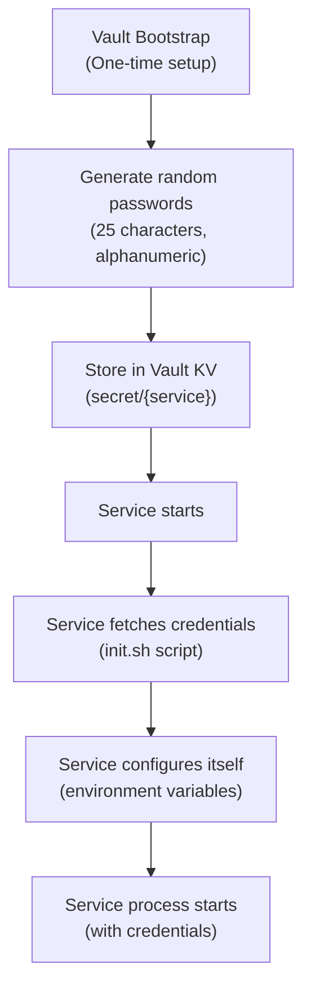
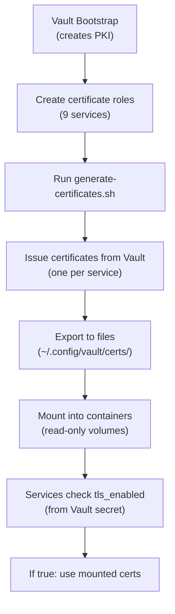
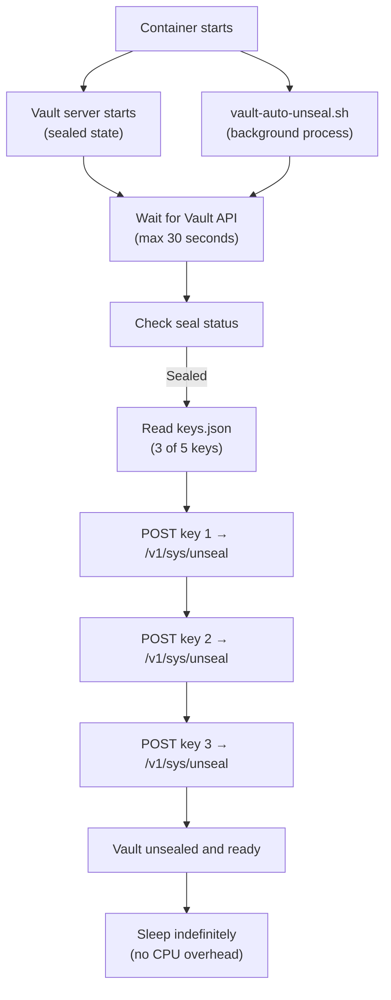

# Vault Integration

Comprehensive guide to HashiCorp Vault integration for secrets management, PKI infrastructure, and credential distribution across all services.

---

## Table of Contents

1. [Overview](#overview)
2. [How Vault Manages Credentials](#how-vault-manages-credentials)
3. [PKI Hierarchy](#pki-hierarchy)
4. [Service Credential Retrieval Pattern](#service-credential-retrieval-pattern)
5. [TLS Certificate Generation](#tls-certificate-generation)
6. [Auto-Unseal Process](#auto-unseal-process)
7. [Common Vault Operations](#common-vault-operations)
8. [Code Examples](#code-examples)
9. [Troubleshooting](#troubleshooting)
10. [Related Documentation](#related-documentation)

---

## Overview

HashiCorp Vault provides **centralized secrets management** and **Public Key Infrastructure (PKI)** for the entire Colima Services infrastructure. Instead of hardcoded passwords in `.env` files, all services fetch credentials from Vault at startup.

### Key Benefits

- ✅ **No Hardcoded Secrets** - All credentials stored securely in Vault
- ✅ **Dynamic Certificate Generation** - TLS certificates issued on-demand
- ✅ **Automatic Rotation** - Certificates can be renewed without service restart
- ✅ **Audit Trail** - Track all secret access attempts
- ✅ **Centralized Management** - Single source of truth for all credentials
- ✅ **Runtime Configuration** - Enable/disable TLS without rebuilding containers

### Vault Endpoints

- **UI:** http://localhost:8200/ui
- **API:** http://localhost:8200
- **Health:** http://localhost:8200/v1/sys/health
- **Internal (from containers):** http://vault:8200

---

## How Vault Manages Credentials

### Storage Architecture

Vault uses a **Key-Value (KV) v2** secrets engine at the path `secret/`.

```
Vault Storage Structure:
├── secret/
│   ├── postgres           # PostgreSQL credentials
│   ├── mysql              # MySQL credentials
│   ├── mongodb            # MongoDB credentials
│   ├── redis-1            # Redis cluster shared password
│   ├── rabbitmq           # RabbitMQ credentials
│   └── <your-app>         # Custom application secrets
└── pki/                   # PKI infrastructure
    ├── root CA
    └── intermediate CA
```

### Credential Format

Each service has credentials stored with this structure:

```json
{
  "data": {
    "user": "dev_admin",
    "password": "randomly-generated-25-char-password",
    "database": "dev_database",
    "tls_enabled": true
  }
}
```

### Credential Lifecycle



---

## PKI Hierarchy

Vault implements a **two-tier Public Key Infrastructure** for certificate management.

### Certificate Authority Structure

```
Root CA (pki)
├── Common Name: Colima Services Root CA
├── Validity: 10 years (87600h)
├── Key Type: RSA 2048
├── Usage: CA, Certificate Signing
└── Intermediate CA (pki_int)
    ├── Common Name: Colima Services Intermediate CA
    ├── Validity: 5 years (43800h)
    ├── Key Type: RSA 2048
    ├── Signed by: Root CA
    └── Service Certificates
        ├── postgres-role (TTL: 1 year)
        ├── mysql-role (TTL: 1 year)
        ├── redis-1-role (TTL: 1 year)
        ├── rabbitmq-role (TTL: 1 year)
        ├── mongodb-role (TTL: 1 year)
        └── ... (9 total roles)
```

### PKI Roles

Each service has a dedicated PKI role that defines certificate issuance policies:

```bash
# Example: postgres-role configuration
vault read pki_int/roles/postgres-role

# Output:
allowed_domains: postgres.dev-services.local
allow_subdomains: false
max_ttl: 8760h (1 year)
key_bits: 2048
allow_ip_sans: true
```

### Certificate Subject Alternative Names (SANs)

Issued certificates include multiple SANs for flexibility:

- **DNS Name:** `postgres.dev-services.local`
- **IP Address:** `172.20.0.10` (static IP)
- **Localhost:** `localhost` (for local testing)
- **Container Name:** `postgres` (Docker DNS)

---

## Service Credential Retrieval Pattern

All services follow the **same pattern** for fetching credentials from Vault at startup.

### Standard Init Script Pattern

Every service uses a wrapper script (`configs/{service}/scripts/init.sh`) that:

1. **Waits for Vault** to be ready (unsealed and accessible)
2. **Fetches credentials** from Vault API
3. **Exports environment variables** for the service
4. **Checks TLS configuration** from Vault
5. **Starts the actual service** with injected credentials

### Example: PostgreSQL Init Script

`configs/postgres/scripts/init.sh`:

```bash
#!/bin/bash
set -e

# 1. Wait for Vault to be ready
wait_for_vault() {
  echo "Waiting for Vault..."
  until curl -sf http://vault:8200/v1/sys/health > /dev/null 2>&1; do
    sleep 2
  done
  echo "Vault is ready"
}

wait_for_vault

# 2. Fetch credentials from Vault
VAULT_RESPONSE=$(curl -sf \
  -H "X-Vault-Token: $VAULT_TOKEN" \
  http://vault:8200/v1/secret/data/postgres)

# 3. Parse and export credentials
export POSTGRES_USER=$(echo "$VAULT_RESPONSE" | jq -r '.data.data.user')
export POSTGRES_PASSWORD=$(echo "$VAULT_RESPONSE" | jq -r '.data.data.password')
export POSTGRES_DB=$(echo "$VAULT_RESPONSE" | jq -r '.data.data.database')

# 4. Check TLS configuration
ENABLE_TLS=$(echo "$VAULT_RESPONSE" | jq -r '.data.data.tls_enabled // "false"')

if [ "$ENABLE_TLS" = "true" ]; then
  echo "TLS enabled - validating certificates..."
  validate_certificates
  configure_postgresql_tls
fi

# 5. Start PostgreSQL with credentials
exec docker-entrypoint.sh postgres
```

### Docker Compose Configuration

Services specify the init script as their entrypoint:

```yaml
services:
  postgres:
    entrypoint: ["/init/init.sh"]
    volumes:
      - ./configs/postgres/scripts/init.sh:/init/init.sh:ro
    environment:
      VAULT_ADDR: http://vault:8200
      VAULT_TOKEN: ${VAULT_TOKEN}
    depends_on:
      vault:
        condition: service_healthy
```

### Credential Retrieval API Call

```bash
# Fetch PostgreSQL credentials
curl -s -H "X-Vault-Token: $VAULT_TOKEN" \
  http://vault:8200/v1/secret/data/postgres | jq

# Response:
{
  "data": {
    "data": {
      "user": "dev_admin",
      "password": "xK9mP2vQ8rL5nT3wY7zF4jH6",
      "database": "dev_database",
      "tls_enabled": true
    }
  }
}
```

---

## TLS Certificate Generation

The system uses **pre-generated certificates** with **Vault-based TLS configuration**.

### Certificate Generation Process



### One-Time Certificate Generation

```bash
# 1. Ensure Vault is bootstrapped
./manage-colima.sh vault-bootstrap

# 2. Generate all certificates
VAULT_ADDR=http://localhost:8200 \
VAULT_TOKEN=$(cat ~/.config/vault/root-token) \
  ./scripts/generate-certificates.sh

# Output:
✓ Generating certificate for postgres...
✓ Generating certificate for mysql...
✓ Generating certificate for redis-1...
✓ Generating certificate for rabbitmq...
✓ Generating certificate for mongodb...
✓ All certificates generated successfully
```

### Certificate Storage Locations

```
~/.config/vault/
├── ca/                      # CA certificates (shared)
│   ├── ca.pem              # Root CA certificate
│   ├── ca-chain.pem        # Full certificate chain
│   └── intermediate-ca.pem # Intermediate CA certificate
└── certs/                   # Service certificates
    ├── postgres/
    │   ├── cert.pem        # Server certificate
    │   ├── key.pem         # Private key
    │   └── ca.pem          # CA bundle
    ├── mysql/
    │   ├── server-cert.pem
    │   ├── server-key.pem
    │   └── ca.pem
    ├── redis-1/
    │   ├── redis.crt
    │   ├── redis.key
    │   └── ca.crt
    └── ... (other services)
```

### Runtime TLS Configuration

TLS can be **enabled or disabled at runtime** without regenerating certificates:

```bash
# Enable TLS for PostgreSQL
TOKEN=$(cat ~/.config/vault/root-token)
curl -sf -X POST \
  -H "X-Vault-Token: $TOKEN" \
  -H "Content-Type: application/json" \
  -d '{"data":{"user":"dev_admin","password":"...","database":"dev_database","tls_enabled":true}}' \
  http://localhost:8200/v1/secret/data/postgres

# Restart service to apply
docker restart dev-postgres

# Disable TLS
curl -sf -X POST \
  -H "X-Vault-Token: $TOKEN" \
  -H "Content-Type: application/json" \
  -d '{"data":{"user":"dev_admin","password":"...","database":"dev_database","tls_enabled":false}}' \
  http://localhost:8200/v1/secret/data/postgres

docker restart dev-postgres
```

### Certificate Rotation

```bash
# 1. Delete old certificates
rm -rf ~/.config/vault/certs/postgres/

# 2. Regenerate certificates
VAULT_ADDR=http://localhost:8200 \
VAULT_TOKEN=$(cat ~/.config/vault/root-token) \
  ./scripts/generate-certificates.sh

# 3. Restart service
docker restart dev-postgres
```

---

## Auto-Unseal Process

Vault automatically initializes and unseals on container start.

### Unseal Mechanism

Vault uses **Shamir Secret Sharing**:
- **5 unseal keys** generated during initialization
- **3 of 5 keys** required to unseal Vault
- Keys stored in `~/.config/vault/keys.json`

### Auto-Unseal Flow



### Entrypoint Configuration

In `docker-compose.yml`:

```yaml
vault:
  entrypoint: >
    sh -c "
    chown -R vault:vault /vault/data &&
    docker-entrypoint.sh server &
    /usr/local/bin/vault-auto-unseal.sh &
    wait -n
    "
```

This starts **two processes**:
1. Vault server (background)
2. Auto-unseal script (background)

### First-Time Initialization

```bash
# Initialize Vault (creates keys and root token)
./manage-colima.sh vault-init

# Output:
Unseal Key 1: K7k9mL2nP5qR8sT1vW4xY6zA...
Unseal Key 2: B3c5dF7gH9jK1mN3oP5qR7sT...
Unseal Key 3: C4e6gI8kL0mN2pR4tV6xZ8aB...
Unseal Key 4: D5f7hJ9lM1nO3qS5uW7yA9cE...
Unseal Key 5: E6g8iK0mN2pQ4rT6vX8zA0dF...

Initial Root Token: hvs.XXXXXXXXXXXXXXXXXX

Keys saved to: ~/.config/vault/keys.json
Root token saved to: ~/.config/vault/root-token
```

**CRITICAL:** Backup these files! Without them, Vault data cannot be recovered.

---

## Common Vault Operations

### Environment Setup

```bash
# Set Vault address
export VAULT_ADDR=http://localhost:8200

# Set root token
export VAULT_TOKEN=$(cat ~/.config/vault/root-token)
```

### Secret Management

```bash
# List all secrets
vault kv list secret/

# Get PostgreSQL credentials
vault kv get secret/postgres

# Get specific field
vault kv get -field=password secret/postgres

# Update password (manual rotation)
vault kv put secret/postgres \
  user=dev_admin \
  password=new_password_here \
  database=dev_database \
  tls_enabled=true

# Store custom application secret
vault kv put secret/myapp/config \
  api_key=abc123 \
  webhook_url=https://example.com/hook
```

### PKI Operations

```bash
# List certificate roles
vault list pki_int/roles

# View role configuration
vault read pki_int/roles/postgres-role

# Issue certificate manually
vault write pki_int/issue/postgres-role \
  common_name=postgres.dev-services.local \
  ttl=8760h

# View CA certificate
vault read pki/ca/pem

# View intermediate CA certificate
vault read pki_int/ca/pem

# Get full CA chain
vault read pki_int/ca_chain
```

### Token Management

```bash
# Check token info
vault token lookup

# Create new token with specific policy
vault token create -policy=admin -ttl=24h

# Renew token
vault token renew

# Revoke token
vault token revoke <token>
```

### Health and Status

```bash
# Check Vault status
vault status

# Check seal status
vault operator seal-status

# Get Vault health
curl http://localhost:8200/v1/sys/health | jq
```

---

## Code Examples

### Python: Fetching Secrets

```python
import requests
import os

def get_vault_secret(secret_path, field=None):
    """Fetch secret from Vault"""
    vault_addr = os.getenv('VAULT_ADDR', 'http://localhost:8200')
    vault_token = os.getenv('VAULT_TOKEN')

    url = f"{vault_addr}/v1/secret/data/{secret_path}"
    headers = {"X-Vault-Token": vault_token}

    response = requests.get(url, headers=headers)
    response.raise_for_status()

    data = response.json()['data']['data']

    if field:
        return data.get(field)
    return data

# Usage
postgres_creds = get_vault_secret('postgres')
print(f"User: {postgres_creds['user']}")
print(f"Database: {postgres_creds['database']}")

# Get specific field
password = get_vault_secret('postgres', field='password')
```

### Go: Vault Client

```go
package main

import (
    "fmt"
    "os"
    vault "github.com/hashicorp/vault/api"
)

func getSecret(path string) (map[string]interface{}, error) {
    config := vault.DefaultConfig()
    config.Address = os.Getenv("VAULT_ADDR")

    client, err := vault.NewClient(config)
    if err != nil {
        return nil, err
    }

    client.SetToken(os.Getenv("VAULT_TOKEN"))

    secret, err := client.Logical().Read(fmt.Sprintf("secret/data/%s", path))
    if err != nil {
        return nil, err
    }

    return secret.Data["data"].(map[string]interface{}), nil
}

func main() {
    creds, err := getSecret("postgres")
    if err != nil {
        panic(err)
    }

    fmt.Printf("User: %s\n", creds["user"])
    fmt.Printf("Database: %s\n", creds["database"])
}
```

### Node.js: Vault Integration

```javascript
const axios = require('axios');

async function getVaultSecret(secretPath, field = null) {
  const vaultAddr = process.env.VAULT_ADDR || 'http://localhost:8200';
  const vaultToken = process.env.VAULT_TOKEN;

  const url = `${vaultAddr}/v1/secret/data/${secretPath}`;

  const response = await axios.get(url, {
    headers: { 'X-Vault-Token': vaultToken }
  });

  const data = response.data.data.data;

  return field ? data[field] : data;
}

// Usage
(async () => {
  const creds = await getVaultSecret('postgres');
  console.log('User:', creds.user);
  console.log('Database:', creds.database);

  const password = await getVaultSecret('postgres', 'password');
  console.log('Password:', password);
})();
```

### Bash: Simple Credential Retrieval

```bash
#!/bin/bash
# scripts/get-vault-secret.sh

VAULT_ADDR=${VAULT_ADDR:-http://localhost:8200}
VAULT_TOKEN=$(cat ~/.config/vault/root-token)

SECRET_PATH=$1
FIELD=$2

# Fetch secret
RESPONSE=$(curl -sf \
  -H "X-Vault-Token: $VAULT_TOKEN" \
  "$VAULT_ADDR/v1/secret/data/$SECRET_PATH")

# Parse with jq
if [ -z "$FIELD" ]; then
  echo "$RESPONSE" | jq -r '.data.data'
else
  echo "$RESPONSE" | jq -r ".data.data.$FIELD"
fi

# Usage:
# ./get-vault-secret.sh postgres password
# ./get-vault-secret.sh postgres
```

---

## Troubleshooting

### Vault is Sealed

**Symptoms:**
```bash
$ curl http://localhost:8200/v1/sys/health
{"sealed": true}
```

**Solution:**
```bash
# Auto-unseal (restart container)
docker restart dev-vault

# Or manual unseal
./manage-colima.sh vault-unseal
```

### Permission Denied

**Symptoms:**
```bash
$ vault kv get secret/postgres
Error: permission denied
```

**Solutions:**
```bash
# Ensure VAULT_TOKEN is set
export VAULT_TOKEN=$(cat ~/.config/vault/root-token)

# Check token validity
vault token lookup

# Use root token
export VAULT_TOKEN=$(cat ~/.config/vault/root-token)
```

### Secret Not Found

**Symptoms:**
```bash
$ vault kv get secret/postgres
No value found at secret/data/postgres
```

**Solution:**
```bash
# Run Vault bootstrap to populate secrets
./manage-colima.sh vault-bootstrap
```

### Service Can't Reach Vault

**Symptoms:**
```bash
# In service logs
curl: (7) Failed to connect to vault port 8200: Connection refused
```

**Solutions:**
```bash
# Check Vault is running
docker ps | grep vault

# Check Vault health
curl http://localhost:8200/v1/sys/health

# Verify network connectivity
docker exec dev-postgres ping -c 2 vault
```

---

## Related Documentation

- **[Network Architecture](./Network-Architecture.md)** - How services communicate
- **[Service Configuration](./Service-Configuration.md)** - Service-specific configs
- **[Security Hardening](./Security-Hardening.md)** - Production security practices
- **[Vault Troubleshooting](./Vault-Troubleshooting.md)** - Vault-specific issues
- **[Testing Guide](./Testing-Guide.md)** - Testing Vault integration

---

## Summary

Vault integration provides:
- **Centralized secrets management** - All credentials in one secure location
- **Dynamic PKI** - Automatic certificate issuance and rotation
- **Runtime configuration** - Enable/disable TLS without rebuilding
- **Audit trail** - Track all secret access
- **Simple integration** - Standard pattern across all services

All services fetch credentials from Vault at startup, enabling zero-hardcoded-secret architecture.
